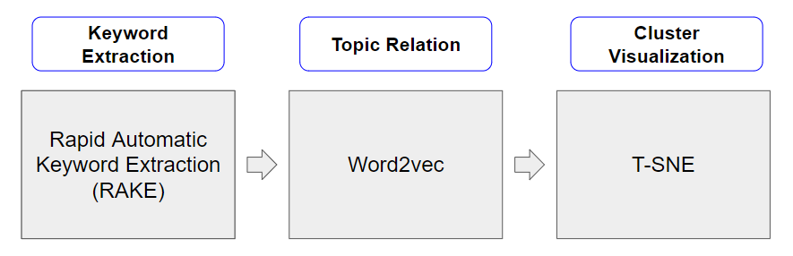

# Autonomous Literature Review 
## Insight Consulting Project with UCSF  

### Introduction

Over the last couple of years, many papers have been published in the medical field using machine learning. While Google Scholar is great for finding a specific paper of a topic of interest, it is not designed for clustering a group of papers with specific topics in mind. We wanted to create a model that properly achieves this goal

### Data 

As we are in the middle of trying to publish our results, we cannot post the abstracts we used for our data. We, however, used 50k abstracts from various medical journals.

### Methodology 

We use Rapid Automatic Keyword Extraction to extract the general keywords. We then use Word2vec and compare all the keywords extracted to a set of reference words that are important to the subtopic we are interested in. The cosine similarity to the closest reference word is used as a score to determine if the word would be important to the subtopic of interest. After analyzing these words, we set a threshold to filter the keywords we are interested in. Finally we use these filtered keywords to cluster the documents by applying T-SNE.

### Requirements

#### Packages

All packages used can be installed using conda or pip for Python 3.7:

*csv*

*gensim*

*numpy*

*matplotlib*

*sklearn*

*pandas*

*wordcloud*

*re*

*rake_nltk*

*nltk*

*nltk stopwords* this can installed after installing nltk by running "python -m nltk.downloader stopwords"

#### Word2vec Embeddings

After testing various embeddings, we decided to use BioWordVec as their embeddings seem to be most appropriate for our model. Further details about how they trained the model and the actual model can be found in the following link: https://github.com/ncbi-nlp/BioSentVec